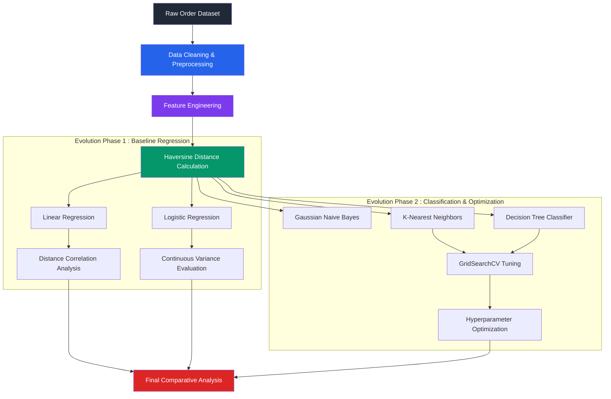
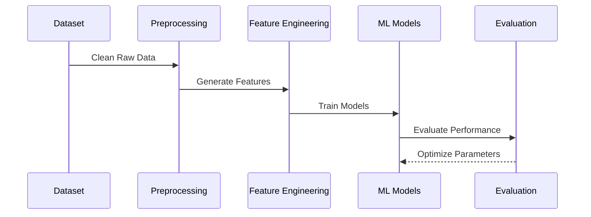

# 🍔 Food Delivery Time Prediction

<div align="center">


# Evolution-Based Machine Learning Workflow for Food Delivery Prediction

A structured machine learning workflow documenting the progression from baseline regression models to tuned classification systems for delivery-time prediction.

</div>

---

# 📌 Overview

This repository documents the development lifecycle of a Food Delivery Time Prediction system using Machine Learning.

The project is organized into chronological evolution phases to demonstrate:
- iterative experimentation
- preprocessing improvements
- feature engineering
- model benchmarking
- hyperparameter optimization

Instead of presenting only a final model, the repository focuses on the engineering and experimentation process behind model development.

---

# 🏗️ Repository Structure

```bash
Food-Delivery-Time-Prediction/
├── evolve_v1/
│   ├── baseline_workflow.ipynb
│   ├── Food_Delivery_Time_Prediction.csv
│   └── README.md
│
├── evolve_v2/
│   ├── advanced_workflow.ipynb
│   └── README.md
│
└── README.md
```

---

# 🗺️ Project Evolution Flow



---

# 📂 Evolution Phases

## 🔹 evolve_v1 — Baseline Regression Modeling

### Scope
- Initial preprocessing workflow
- Coordinate cleaning
- Exploratory Data Analysis
- Baseline regression implementation

### Implemented Models
- Linear Regression
- Logistic Regression

### Key Observations
- Delivery distance strongly correlates with delivery duration
- High continuous variance impacts regression performance
- Preprocessing quality significantly affects predictions

---

## 🔹 evolve_v2 — Classification & Hyperparameter Tuning

### Scope
- Classification benchmarking
- Hyperparameter optimization
- Cross-validation workflows
- Comparative model evaluation

### Implemented Models
- Gaussian Naive Bayes
- K-Nearest Neighbors
- Decision Tree Classifier

### Optimization Techniques
- GridSearchCV
- Parameter tuning
- Cross-validation

### Key Observations
- Decision Trees improved interpretability
- Tuned KNN achieved improved classification performance
- Hyperparameter optimization significantly affected model accuracy

---

# ⚙️ Machine Learning Workflow



---

# 📊 Feature Engineering

## 🌍 Haversine Distance

A major engineered feature in this project is the Haversine Distance calculation used to estimate geographical distance between restaurant and customer coordinates.

This feature helps:
- improve spatial understanding
- enhance prediction accuracy
- model real-world delivery conditions more effectively

---

# 🧠 Tech Stack

| Category | Technologies |
|---|---|
| Programming Language | Python |
| Data Processing | Pandas, NumPy |
| Visualization | Matplotlib, Seaborn |
| Machine Learning | Scikit-Learn |
| Notebook Environment | Jupyter Notebook |
| Optimization | GridSearchCV |
| Version Control | Git & GitHub |

---

# 📈 Learning Outcomes

This project explores:
- data preprocessing workflows
- regression and classification techniques
- feature engineering
- model benchmarking
- hyperparameter optimization
- comparative evaluation strategies

---