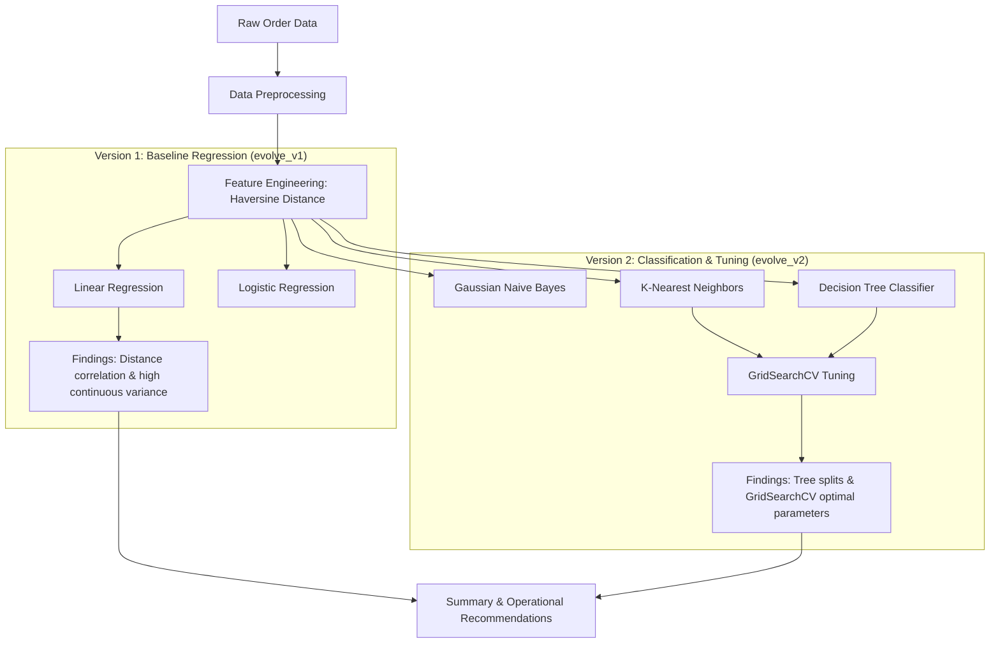

# Food Delivery Time Prediction

This repository contains notebooks and documentation for analyzing and predicting food delivery times. The project is structured sequentially into chronological version directories to show progression from baseline models to hyperparameter-tuned classifiers.

---

## 📁 Repository Structure

The files are organized into sequential version folders:

```directory
Food-Delivery-Time-Prediction/
├── evolve_v1/
│   ├── baseline_workflow.ipynb                   # Preprocessing & baseline regression models (Version 1)
│   ├── Food_Delivery_Time_Prediction.csv         # Raw delivery order dataset
│   └── README.md                                 # Baseline regression details & EDA
├── evolve_v2/
│   ├── advanced_workflow.ipynb                   # Classification benchmarking & hyperparameter tuning (Version 2)
│   └── README.md                                 # Tuned classification benchmarks & GridSearchCV results
└── README.md                                      # Repository project overview
```

---

## 🗺️ Project Progression Flowchart



---

## 🔬 Subfolder Documentation & Notebooks

Detailed information on the preprocessing, models, and findings for each phase is documented inside the version folders:

1. **[evolve_v1/](file:///c:/Users/admin/VSCode/ML/Food-Delivery-Time-Prediction/evolve_v1)**: Baseline Regression Modeling & Coordinates Preprocessing.
   - Notebook: [baseline_workflow.ipynb](file:///c:/Users/admin/VSCode/ML/Food-Delivery-Time-Prediction/evolve_v1/baseline_workflow.ipynb)
   - Phase Document: [evolve_v1/README.md](file:///c:/Users/admin/VSCode/ML/Food-Delivery-Time-Prediction/evolve_v1/README.md)
2. **[evolve_v2/](file:///c:/Users/admin/VSCode/ML/Food-Delivery-Time-Prediction/evolve_v2)**: Advanced Classification Benchmarking & Hyperparameter Tuning.
   - Notebook: [advanced_workflow.ipynb](file:///c:/Users/admin/VSCode/ML/Food-Delivery-Time-Prediction/evolve_v2/advanced_workflow.ipynb)
   - Phase Document: [evolve_v2/README.md](file:///c:/Users/admin/VSCode/ML/Food-Delivery-Time-Prediction/evolve_v2/README.md)
