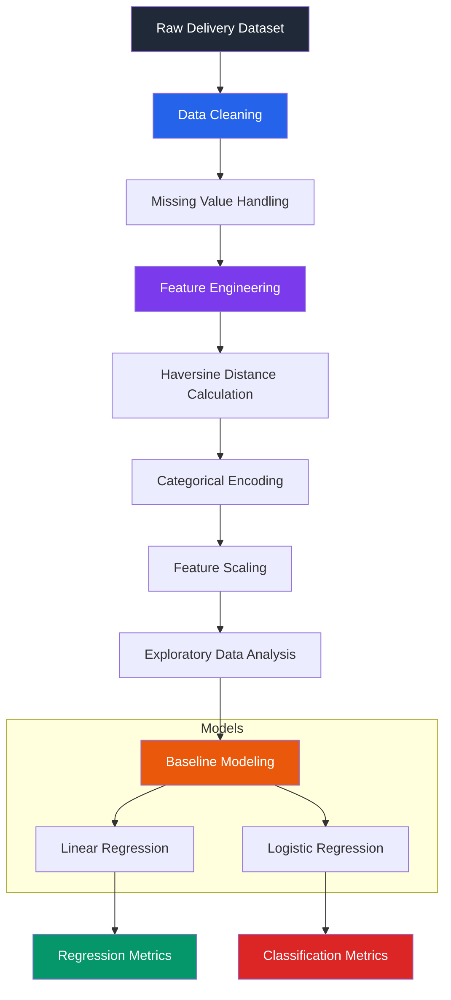

# Baseline Regression — Preprocessing & Modeling (`evolve_v1`)

This phase focuses on establishing the initial machine learning workflow for food delivery prediction through preprocessing, exploratory analysis, and baseline regression/classification models.

---

# 📌 Objectives

## Regression Task
Predict the exact delivery duration in minutes using continuous regression models.

## Classification Task
Classify deliveries into operational categories:
- **Fast**
- **Delayed**

based on the 75th percentile of delivery duration.

---

# 🏗️ Workflow Pipeline

---

# 📂 Data Preprocessing & EDA

## Data Cleaning
- Checked data integrity and confirmed zero missing or null values in the dataset.
- Resolved inconsistent entries in coordinate formatting.

## Feature Engineering
Implemented Haversine Distance calculation using geographical coordinates to model real-world travel distance between restaurant and customer locations.

## Data Transformation

### Categorical Encoding
Encoded operational categorical features:
- `Weather_Conditions`
- `Traffic_Conditions`
- `Vehicle_Type`

### Feature Scaling
Normalized continuous variables:
- `Distance_calc` (recalculated distance)
- `Delivery_Person_Experience`
- `Restaurant_Rating`
- `Customer_Rating`
- `Order_Cost`
- `Tip_Amount`

to improve training stability and model convergence.

---

# 📊 Exploratory Data Analysis

EDA was performed to identify delivery-time patterns and operational bottlenecks.

### Analysis Performed
- Feature correlation analysis
- Outlier detection using boxplots
- Distribution analysis of delivery durations
- Impact analysis of traffic and weather conditions

### Observations
- Distance showed strong correlation with delivery duration
- Traffic conditions introduced high variance
- Weather penalties affected prediction stability

---

# 🤖 Baseline Models

## Linear Regression

### Purpose
Predict continuous delivery duration in minutes.

### Evaluation Metrics
- Mean Squared Error (MSE)
- Mean Absolute Error (MAE)
- R² Score

### Observations
Linear relationships captured basic delivery trends but struggled with:
- traffic congestion patterns
- operational delays
- non-linear environmental effects

---

## Logistic Regression

### Purpose
Classify deliveries as:
- Fast
- Delayed

### Evaluation Metrics
- Accuracy
- Precision
- Recall
- Confusion Matrix

### Observations
Classification-based delivery categorization produced more operationally stable predictions compared to continuous-time estimation.

---

# 📈 Key Findings

## Linear Assumption Limitation
Linear Regression assumes additive independent effects, which limits performance under:
- traffic gridlocks
- weather disruptions
- restaurant waiting delays

These factors introduce non-linear delivery behavior.

## Continuous Variance
Delivery duration prediction contained high variance due to:
- courier delays
- restaurant preparation variability
- environmental conditions

This demonstrated that categorical delivery-state prediction can sometimes serve as a more reliable operational metric than exact-minute prediction.

---

# 🧠 Concepts Explored

- Data preprocessing workflows
- Feature engineering
- Haversine distance computation
- Regression modeling
- Binary classification
- Feature scaling
- Exploratory Data Analysis
- Model evaluation metrics

---