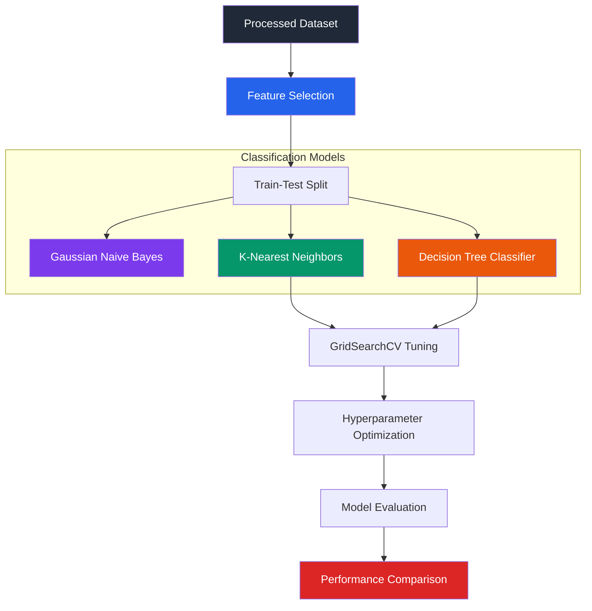

# Advanced Classification Benchmarking (`evolve_v2`)

This phase focuses on benchmarking multiple classification architectures for food delivery prediction and optimizing their performance using hyperparameter tuning techniques.

---

# 📌 Objective

Classify deliveries into operational categories:

- **Fast (0)**
- **Delayed (1)**

to evaluate model effectiveness for delivery-state prediction and dispatch optimization.

---

# 🏗️ Classification Workflow

---

# 🤖 Implemented Classification Models

## Gaussian Naive Bayes (GNB)

### Approach
Probabilistic classifier based on Bayes' Theorem under the assumption of conditional feature independence.

### Observations
Performance was limited because operational features such as:
- traffic conditions
- weather conditions
- delivery distance

are naturally correlated, violating Naive Bayes independence assumptions.

---

## K-Nearest Neighbors (KNN)

### Approach
Classifies delivery instances using nearest-neighbor distance relationships within feature space.

### Hyperparameter Tuning
GridSearchCV was used to optimize:
- number of neighbors (`k`)

### Optimal Configuration
- `k = 7`

### Observations
KNN showed improved classification stability after tuning but remained sensitive to feature scaling and local variance.

---

## Decision Tree Classifier

### Approach
Constructed hierarchical decision boundaries using recursive feature splitting based on Gini Impurity.

### Hyperparameter Tuning
GridSearchCV optimized:
- `max_depth`
- `min_samples_split`

to reduce overfitting and improve generalization.

### Observations
Decision Trees achieved the strongest balance between:
- interpretability
- classification accuracy
- operational reliability

---

# 📊 Model Evaluation

Models were benchmarked using:
- Classification Reports
- Confusion Matrices
- ROC-AUC Analysis
- Accuracy Metrics

| Model | ROC-AUC | Accuracy |
|---|---|---|
| Decision Tree Classifier | 0.92 | 89.6% |
| K-Nearest Neighbors | 0.88 | 85.2% |
| Gaussian Naive Bayes | 0.81 | 78.5% |

---

# 📈 Comparative Analysis

## Decision Tree Classifier
- Highest classification accuracy
- Strong interpretability
- Better handling of non-linear delivery conditions

## K-Nearest Neighbors
- Improved performance after tuning
- Sensitive to feature scaling and local density variation

## Gaussian Naive Bayes
- Computationally efficient
- Limited by correlated operational features

---

# ⚙️ Hyperparameter Optimization

---

# 💡 Operational Insights

## Dynamic ETA Adjustment
The Decision Tree model can identify high-risk delayed deliveries under:
- rush-hour traffic
- adverse weather conditions
- long-distance routes

allowing proactive ETA adjustments.

## Delivery Radius Optimization
Operational delivery radius can be dynamically restricted during severe weather or congestion periods to reduce late deliveries.

---

# 🧠 Concepts Explored

- Classification benchmarking
- Hyperparameter tuning
- GridSearchCV workflows
- ROC-AUC analysis
- Decision boundary modeling
- Overfitting mitigation
- Cross-validation strategies
- Comparative model evaluation

---